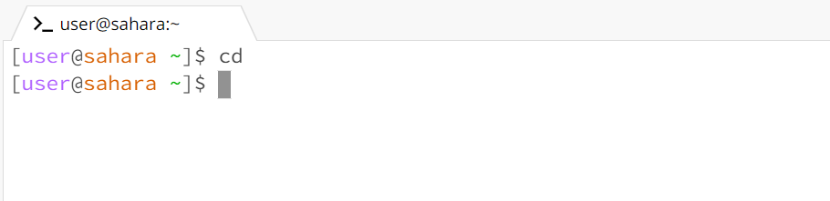
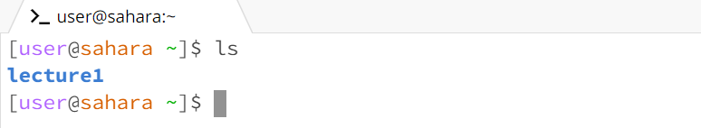
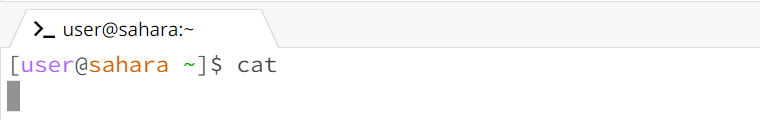

# Lab Report 1

In this blog post, we'll explore three fundamental filesystem commands: cd, ls, and cat. These commands are essential for navigating, listing files, and viewing content within directories in a Unix-based system. We'll demonstrate different ways of using these commands, showcasing their versatility and practicality.

# cd
The cd command, short for "change directory," allows us to change our current working directory.

__Using cd with no arguments__

Working directory: The home directory
 
Output Explanation: Using 'cd' without arguments takes us to the user's home directory
 
Error Indication: No Error
 
 

__Using cd with a path to a directory as an argument__

Working Directory: The home directory
 
Output Explanation: The cd command with a directory path to 'lecture1' as an argument changes the working directory to 'lecture1'.
 
Error Indication: No error.

__Using cd with a path to a file as an argument__

Working directory: The current working directory before executing the command
 
Output Explanation: Using cd with a file path as an argument results in an error because cd can only change to directories, not files.
 
Error Indication: Error: Not a directory.

# ls
The ls command, which stands for "list," is used to list files and directories in a directory.

__Using ls with no arguments__

Working Directory: The home directory.
 
Output Explanation: Running ls without arguments lists the files and directories in the current directory. The only directory in 'home' is 'lecture1' so this is listed. Any files in 'home' are in 'lecture1' so are not displayed.
 
Error Indication: No error.

__Using ls with a path to a directory as an argument__

Working Directory: The home directory.
 
Output Explanation: The ls command with a directory path of 'lecture1' lists the files and directories in 'lecture1'.
 
Error Indication: No error.

__Using ls with a path to a file as an argument__

Working Directory: The current working directory before executing the command.
 
Output Explanation: Using ls with a file path as an argument lists the specified file, but it's generally used for directories.
 
Error Indication: No error.

# cat
The cat command is used to display the contents of a file.

__Using cat with no arguments__

Working Directory: The home directory.
 
Output Explanation: Running cat without arguments results in an error because it expects a file to display.
 
Error Indication: Error: No such file or directory.

__Using cat with a path to a directory as an argument__

Working Directory: The home directory.
 
Output Explanation: The cat command with a directory path as an argument results in an error because it expects a file, not a directory.
 
Error Indication: Error: Is a directory.

__Using cat with a path to a file as an argument__

Working Directory: The current working directory before executing the command.
 
Output Explanation: The cat command with a file path as an argument displays the contents of the specified file.
 
Error Indication: No error.